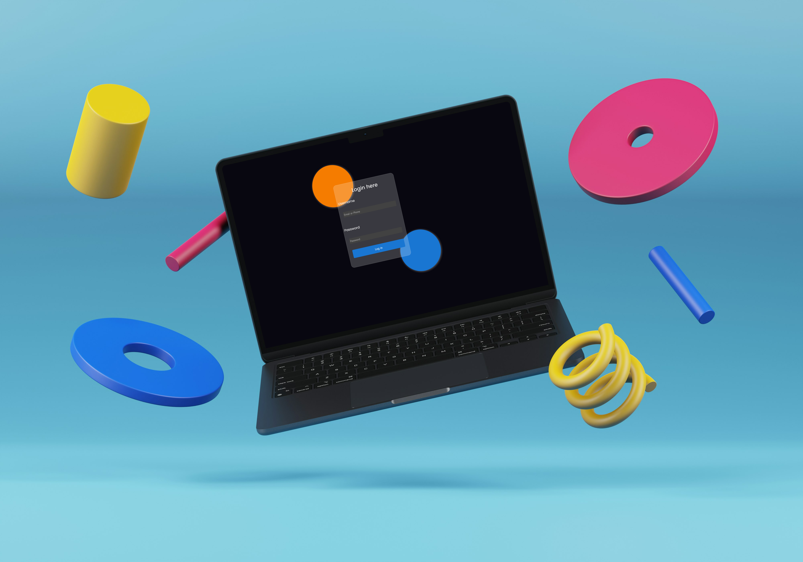

# ✨ Glassmorphism Login Page

A beautiful **glass-style login form** using only **HTML** and **CSS** with a modern UI design trend: **Glassmorphism**. Perfect for landing pages, modern UI projects, and learning CSS effects like backdrop blur.

---

## 🌟 Features

- 🟠 Glassmorphism effect using `backdrop-filter`
- 🧊 Frosted background with transparent borders
- 🎨 Custom font (Poppins)
- 🟠 & 🔵 Decorative background circles
- ✅ Responsive and elegant layout (for small containers)

---

## 📸 Preview



---

## 🗂️ Folder Structure

```plaintext
📁 glass-login/
├── login.html
├── login.css
├── poppins/
│   └── Poppins-Regular.otf
└── README.md
